# Ortus Outreach

## GDs Manual

A complete, end-to-end guide to running LinkedIn outreach campaigns with the Ortus automation tool — from first login to your first hundred connections, and every control on the deck in between.

---

<div class="cover-meta">

**Version** · {{VERSION}}  
**Edition** · GDs Manual, First Edition  
**Date** · {{DATE}}  
**Audience** · Ortus GDs running campaigns daily

</div>

<div class="page-break"></div>

## What this is

Ortus Outreach is an in-house tool for running personalised LinkedIn outreach at scale. It reads a list of leads from a Google Sheet, rotates a pool of LinkedIn accounts (via GoLogin browser profiles), and performs one of five actions against each lead — a connection invite, a direct message, a premium InMail, a free Open Profile message, or a status check of yesterday's invites. Results are written back to the sheet row-by-row.

You run one campaign at a time. Each campaign is defined by five choices:

- **Mode** — what action to take on each lead
- **Rate & limits** — how fast, and how much per account
- **Source sheet** — where the leads come from
- **Accounts** — which LinkedIn logins do the work
- **Templates** — the words that go out

This manual walks you through all five, plus everything around the edges: live status, history, schedules, presets, passover watching, and what to do when something goes wrong.

## Who this is for

You are an Ortus GD. You know what LinkedIn is, you know what a Sales Navigator seat is, you know what GoLogin is for, and you don't need a primer on why we don't just send all the invites at once. This manual assumes you've been handed an account and you want to run a campaign well.

It is **not** a setup guide for a fresh machine. The app is already running; you will be given a link. This is the day-two-onward manual — the thing to keep open while you work.

## How to read this

Read the first three sections in order — **Sign in and your first campaign**, **The console**, and **The five modes**. Everything after that is reference: dip into whichever section matches what you're trying to do right now. The last page is a printable quick-reference card.

## Conventions in this manual

- **Bold** marks a UI element or a button you press.
- `Monospace` marks something you type, paste, or find in a field.
- Screenshots show the dark theme (the default). The app also has a light theme — the layout is identical.
- Section numbers (§1, §2…) reference the numbered sections in the app.

<div class="page-break"></div>

# 1. Sign in and your first campaign

## 1.1 Signing up

Sign-up is gated by the **State of Operations** sheet. Your email must already be on that sheet before you can create an account. If you're new, ask the admin to add you first.

Once you're on the sheet:

1. Open the app link you were given and click **Sign up** at the bottom.
2. Enter your Ortus email. It must match the one on the State of Operations sheet exactly.
3. Pick a password — minimum 8 characters.
4. Confirm.

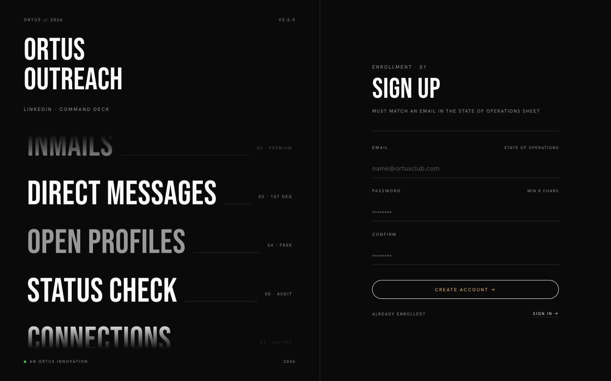

If you get "email not found on State of Operations sheet," the admin hasn't added you yet. If you get "email already registered," skip to §1.2 and sign in instead.

## 1.2 Signing in

After the first time, this is how you enter the app.

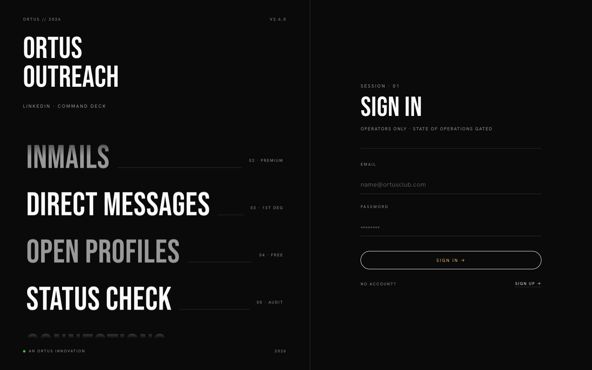

Enter your email and password. The app keeps you signed in across sessions on the same browser.

## 1.3 Your first campaign — ten minutes, five choices

The fastest path from zero to "campaign running" is five decisions, each in its own section down the main column. The numbers in the sidebar match the numbers on screen.

1. **Mode** (§1) — pick **Connect Only** for your first campaign. It's the safest.
2. **Rate & Limits** (§2) — leave the defaults: 6 connections per hour, 40 total per account.
3. **Google Sheet URL** (§3) — paste a public sheet with at least a `LinkedIn URL` column. Press **Preview Sheet** to confirm it reads.
4. **Accounts** (§4) — click the **Assigned to me** preset to auto-pick the profiles that are yours. If you're just testing, pick one account.
5. **Templates** (§5) — answer **No** to "Do you want to add a note while connecting?" for your first run — a note-less invite is actually more deliverable.
6. **Launch** (§6) — confirm the numbers at the top (connections × accounts × ETA), make sure **Now** is selected, click **Start Campaign**.

That's it. Scroll to **Live Status** to watch it go.

<div class="page-break"></div>

# 2. The console

The whole app is one page. It has three columns plus a bar along the bottom.

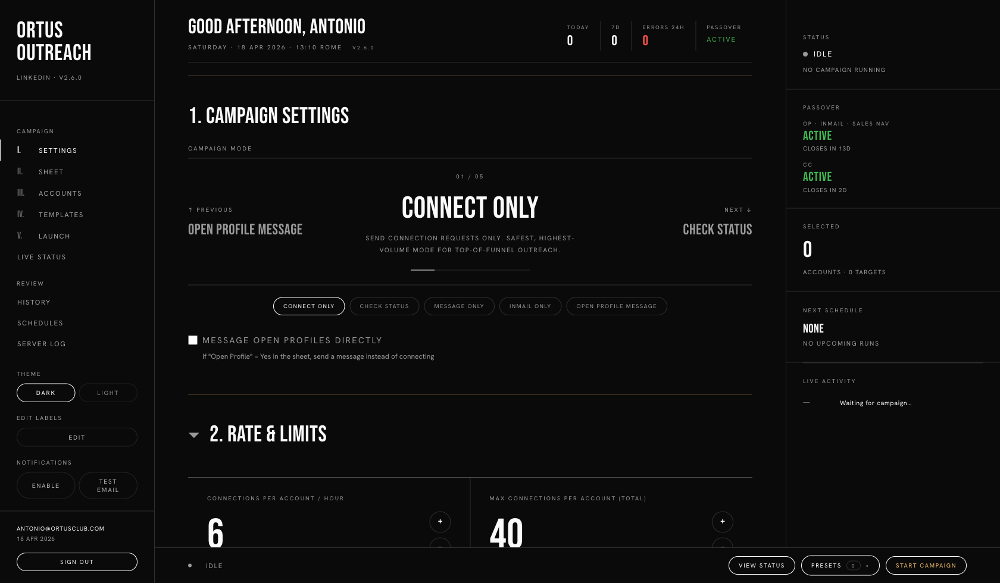

## 2.1 Left — the sidebar

The sidebar is your table of contents. It doesn't route you anywhere new; the numbered items scroll you to the matching section in the main column. Use it when the page gets long.

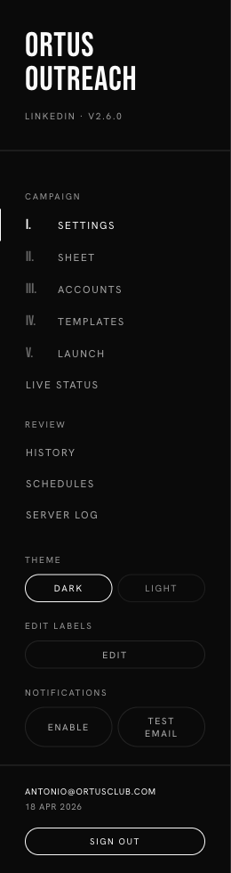

Top to bottom:

- **Brand** — version tag sits just under the wordmark. Handy when the admin asks which version you're on.
- **Campaign** — the five numbered sections, in order.
- **Review** — History, Schedules, and the Server Log (collapsible live tail of what the backend is doing — useful when something feels stuck).
- **Theme** — dark or light. Identical functionality, personal taste.
- **Edit labels** — lets you rename any visible label on the page. Changes are local to your browser; useful if you want the app to speak your team's vocabulary.
- **Notifications** — turn on browser push so the app can ping you when a campaign finishes. **Test email** sends a probe to your own inbox.
- **Footer** — who you're signed in as + today's date, plus **Sign out**.

## 2.2 Centre — the deck

The main column is where the work happens. Six numbered sections stack down the page: **1. Campaign Settings**, **2. Rate & Limits**, **3. Google Sheet URL**, **4. Accounts**, **5. Templates**, **6. Launch** — followed by **Live Status**, **Campaign History**, and **Campaign Schedules** for review.

Most sections are **collapsible**. Click the heading to open or close. The caret (▾) rotates to show state.

## 2.3 Top — header stats

Four at-a-glance numbers across the top of the main column:

- **Today** — connections sent since midnight (your local time).
- **7D** — rolling seven-day total.
- **Errors 24h** — anything that went wrong in the last day.
- **Passover** — the current state of LinkedIn's monthly credit reset (see §11).

These update live while a campaign is running.

## 2.4 Right — the command centre

The right-hand column is an always-on dashboard. It is visible on wide laptop screens (≥1500px or so); on narrower windows it collapses away.

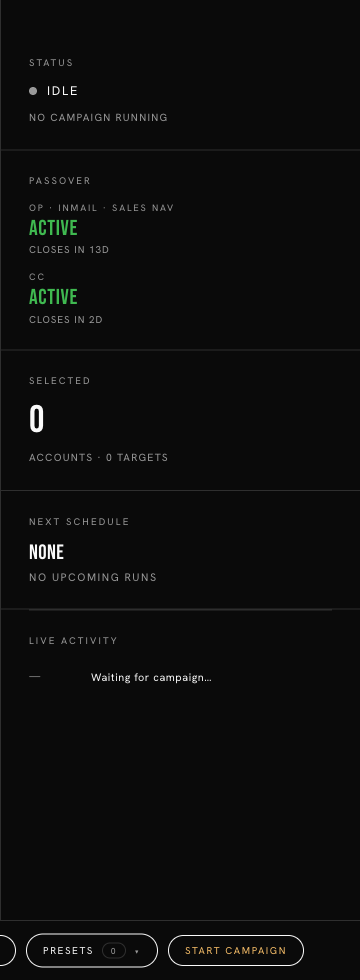{width=240px .inline-right}

It shows — in order — the current run status, the state of both passovers, how many accounts/targets are selected, the next scheduled run (if any), and a live feed of what's happening right now. You don't interact with it much; you glance at it.

<div class="clear"></div>

## 2.5 Bottom — the run bar

A sticky bar that stays at the bottom of the screen no matter how far you scroll.

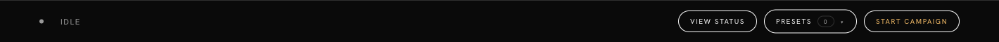

From left to right:

- **State dot + text** — Idle, Running, Stopping, Finished.
- **View Status** — jumps you to the Live Status section.
- **Presets** — opens a popover with your saved configurations and a "Last used" shortcut (see §10).
- **Start Campaign** — the one button you actually need when the deck is loaded. It's the gold pill; you can't miss it.

<div class="page-break"></div>

# 3. The five modes

The first decision is what the campaign actually *does*. There are five modes. Pick one — you can't run two at once.

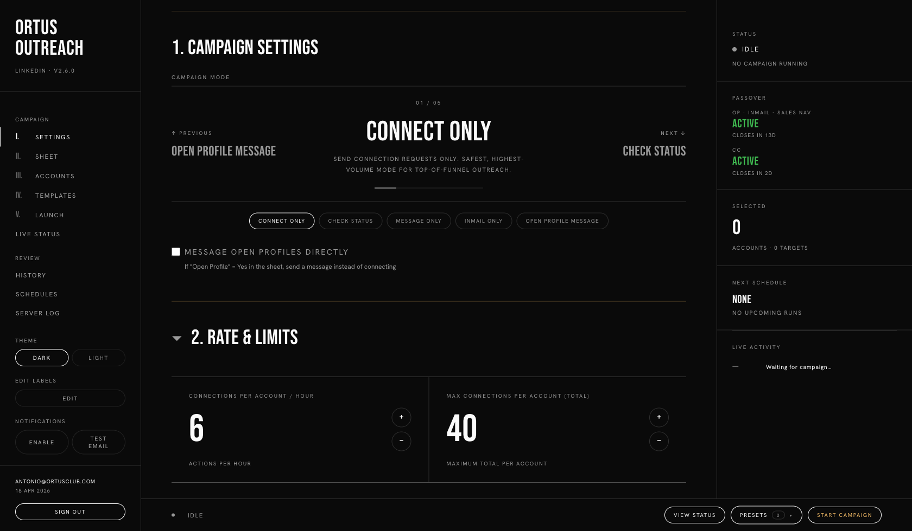

The mode selector is a carousel: **Previous** and **Next** cycle through the modes, or click any of the chip buttons below to jump straight to one. The counter (`01 / 05`) shows where you are in the list.

## 3.1 Connect Only — mode 01

The bread and butter. Sends a LinkedIn connection invite to each lead, optionally with a short note.

- **When to use it:** top-of-funnel outreach, anyone you're not already connected to.
- **What it needs:** leads with `LinkedIn URL`; optionally a connection-note template.
- **What it writes back to the sheet:** `Status = Invite Pending` and `Date Last Action`.
- **Watch out for:** LinkedIn's weekly invite limit (roughly 100/account/week — that's why we cap at 40/day). Sending without a note is actually slightly more deliverable on most accounts.

There's a sub-toggle underneath the mode chips called **Message Open Profiles directly**. If it's on, and a lead's `Open Profile` column in the sheet says "yes", the app will skip the invite and send a free direct message instead. See §3.5.

## 3.2 Check Status — mode 02

Doesn't send anything. It **audits** leads that are in `Invite Pending` state — checks if each invite has been accepted, declined, or is still pending, and updates the sheet.

- **When to use it:** the day after a connect campaign, or weekly as a housekeeping pass.
- **What it needs:** leads with `Status = Invite Pending` in the sheet.
- **What it writes back:** `Status = Connected | Declined | Invite Pending` (unchanged).
- **Why it exists:** LinkedIn doesn't notify you cleanly when invites are accepted. Without a status check, your sheet drifts out of date.

## 3.3 Message Only — mode 03

Sends a direct message to **first-degree** connections (people you're already connected to).

- **When to use it:** follow-up sequences, re-engagement, event invitations to known contacts.
- **What it needs:** leads who are already 1st-degree; a follow-up-message template.
- **What it writes back:** `Message = sent`.
- **Watch out for:** if a lead is not 1st-degree, the message button won't appear and the row will be skipped with an error. This is expected and safe.

## 3.4 InMail Only — mode 04

Sends a premium LinkedIn InMail — works on anyone, regardless of connection status, but burns a **credit** from the sending account's Sales Navigator allotment.

- **When to use it:** high-value targets you can't reach any other way.
- **What it needs:** accounts with InMail credits; subject + body template.
- **What it writes back:** `Status = InMail Sent`, `InMail = sent`, and the credit count in the audit notes.
- **Watch out for:** credits are **expensive** — track them. See §11 on passover.

## 3.5 Open Profile Message — mode 05

LinkedIn lets **Premium** members enable "Open Profile" on their own profile — anyone can message them without a connection, and it's **free**. If you've tagged a lead as Open Profile in your sheet, this mode finds them and messages them directly.

- **When to use it:** you have a list pre-qualified as Open Profile.
- **What it needs:** leads with `Open Profile = yes`; subject (optional) + body template.
- **What it writes back:** `Status = OP Message Sent`, `OP = sent`.
- **Watch out for:** if the lead isn't actually Open Profile when the app arrives, the row gets flagged `Not Open Profile` and skipped in future runs. False positives don't cost anything.

## Pick-one-of-five cheat sheet

| Mode | Sends | Works on | Cost | Use when |
|---|---|---|---|---|
| Connect Only | Invite (+ note) | Anyone 2nd/3rd deg | Invite quota | Top of funnel |
| Check Status | Nothing | Pending invites | Free | Day after Connect |
| Message Only | Direct message | 1st-degree only | Free | Follow-ups |
| InMail Only | Premium InMail | Anyone | 1 credit | High-value only |
| Open Profile | Direct message | OP-flagged leads | Free | Pre-qualified list |

<div class="page-break"></div>

# 4. Rate & Limits

The second decision is how fast and how much. These three numbers decide the shape of your day.

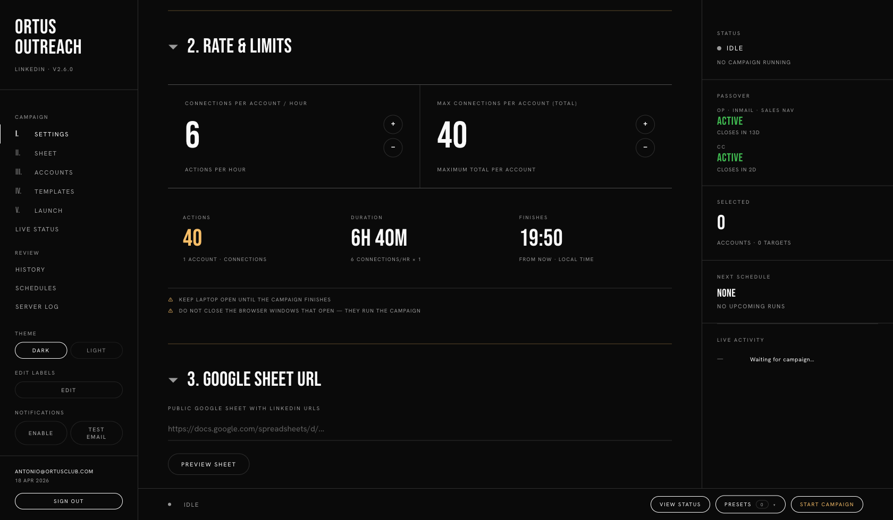

## 4.1 The three controls

- **Connections per account per hour** — throttle. Default **6**. Range 1–30.
- **Max connections per account (total)** — ceiling. Default **40**. Range 1–100.
- **Gap between messages (seconds)** — only shown for messaging modes. Default **60**. Range 10–600.

Each control is a **stepper**: tap the value to type a number, or use the + / − buttons. Changes update the summary below in real time.

## 4.2 Why the defaults are low

LinkedIn throttles accounts that behave like bots. Two numbers matter:

- **The weekly invite cap.** Since 2021, LinkedIn enforces roughly 100 invites per account per week on new accounts. Old, warm accounts get more leeway.
- **The behavioural model.** Bursts of identical actions trip the classifier. Spreading actions over time — six an hour, not forty in ten minutes — looks like a human.

Six per hour × six or seven hours = ~40 per day per account. That's the sweet spot: enough volume to matter, slow enough to not trip flags. Don't go above 10/hr unless you have a reason and an account you're willing to burn.

## 4.3 The campaign summary

Below the steppers, the **summary** hero shows you what you've just committed to:

- **Actions** — the total (selected accounts × per-account ceiling, or the sheet size, whichever is smaller).
- **Duration** — how long the campaign will take, given your rate.
- **Finishes** — the local time it will wrap up.

If the Finishes time is after midnight, reconsider your settings — either you've selected too few accounts, too large a sheet, or too slow a rate.

## 4.4 The two warnings

Under the summary:

> **Keep your laptop open until the campaign finishes.**  
> **Do not close the browser windows that open — they run the campaign.**

These are not decorative. The campaign runs in headless-ish Chrome windows that GoLogin spawns locally. If you close the lid, they stop. If you close those windows, they stop. Plug in, disable sleep, walk away.

<div class="page-break"></div>

# 5. The Google Sheet

The third decision is where the leads come from. Ortus Outreach reads **public** Google Sheets — no API keys, no OAuth, just paste the URL.


## 5.1 Sharing the sheet

The sheet must be set to **Anyone with the link can view** — at minimum. Writer permissions are not required; the app writes back via a separate service path, but viewer is enough for reads.

To verify the sheet is readable, click **Preview Sheet**. If the app can reach it, you'll see a table of the first handful of rows. If not, you'll get a "Failed to fetch" error — 99% of the time that's because the sheet is private.

## 5.2 Required columns

**Only one column is strictly required:** a column containing LinkedIn profile URLs. The app auto-detects the LinkedIn column by scanning for `linkedin.com/in/` patterns, so you can call the column whatever you like (`LinkedIn URL`, `Profile`, `URL`, etc.).

## 5.3 Recommended columns

If present, the app will use these for personalisation and filtering:

| Column | Used for | Aliases accepted |
|---|---|---|
| `First Name` | `{firstName}` placeholder | `firstName`, `first_name` |
| `Last Name` | `{lastName}` placeholder | `lastName`, `last_name` |
| `Company` | `{company}` placeholder | `company` |
| `Title` | `{title}` placeholder | `title`, `Job Title` |
| `Open Profile` | Routes lead to OP path (value = `yes`) | `openProfile`, `open_profile` |
| `Assignee` | Lets GDs filter "Assigned to me" | — |

**Any column** in the sheet becomes available as a `{placeholder}` in your templates, not just the ones above. If your sheet has a column `City`, you can write `{city}` in a template and it will be filled in per-row.

## 5.4 Columns the app will create and write

The app keeps the sheet up to date. If these columns don't exist, they'll be created on first run:

| Column | Written by | Values |
|---|---|---|
| `Status` | All modes | `Invite Pending`, `Connected`, `Declined`, `InMail Sent`, `OP Message Sent`, `Not Connectable`, `Not Open Profile` |
| `OP` | Open Profile mode, Connect+OP path | Hyperlink to message or blank |
| `Message` | Message mode | Hyperlink to message or blank |
| `InMail` | InMail mode | Hyperlink to thread or blank |
| `Account Used` | All | Email of the GoLogin account that did the work |
| `Date Last Action` | All | ISO date |

Don't manually edit these columns while a campaign is running.

<div class="page-break"></div>

# 6. Accounts (GoLogin)

The fourth decision is which LinkedIn accounts do the sending. Each one is a GoLogin browser profile — an isolated Chrome with its own cookies, fingerprint, and session.

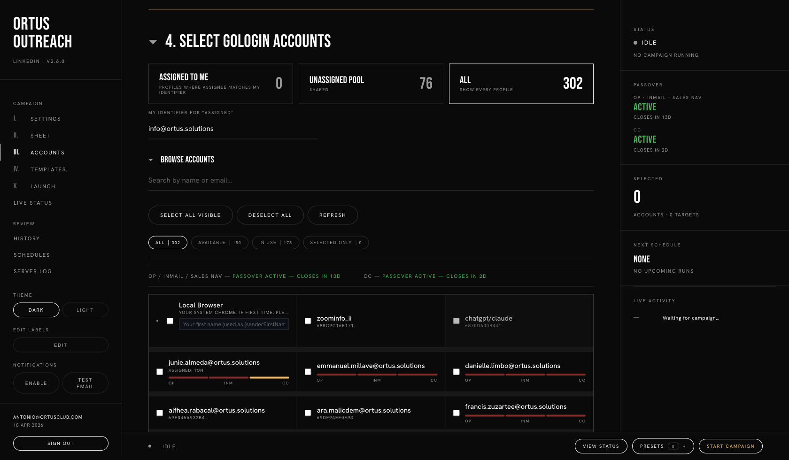

## 6.1 The three presets

At the top of the Accounts section are three preset buttons:

- **Assigned to me** — profiles where the `Assignee` field matches the identifier you've typed into **My identifier**. Useful on teams where profiles are owned by specific people.
- **Unassigned Pool** — profiles with no assignee. Shared accounts anyone can use.
- **All** — show every profile. This is the default.

The count next to each preset tells you how many profiles are in that bucket.

## 6.2 My identifier

Just below the presets, there's a small field: **My identifier for "Assigned"**. Type your Ortus email (or your name — whatever's in the Assignee column of the GoLogin profiles). The "Assigned to me" preset filters against this string.

The app remembers this across sessions. Set it once.

## 6.3 Browse Accounts — search, filter, pick

Expand **Browse Accounts** to see every profile as a card.

- **Search** — live filter by name or email.
- **Select All Visible / Deselect All / Refresh** — bulk actions.
- **Filter chips** — four live counts:
  - **All** — every profile in view
  - **Available** — profiles with recent successful logins, not currently in use
  - **In use** — profiles a campaign is currently running through
  - **Selected only** — just the ones you've ticked

Click a card to select/deselect. The selected count updates in the right pane live.

## 6.4 Passover banner

Above the profile grid you'll see a banner like:

> OP / INMAIL / SALES NAV — PASSOVER ACTIVE — CLOSES IN 13D  
> CC — PASSOVER ACTIVE — CLOSES IN 2D

This is LinkedIn's credit-reset cycle. When the banner is green and "Active," credits are fresh and you can use InMail/Open Profile paths freely. When it's amber or closed, you're in the tail of the cycle — think twice before burning the last credits. See §11 for the full explanation.

## 6.5 Execution order

Once you've selected profiles, an **Execution order** panel appears below the grid. The order from top to bottom is the order the campaign will use them in — first profile does its 40, then the second, and so on.

Drag to reorder if you have preferences.

<div class="page-break"></div>

# 7. Templates

The fifth decision is what you actually send. Templates live in §5 of the console, and which sub-sections appear depends on the mode you picked.

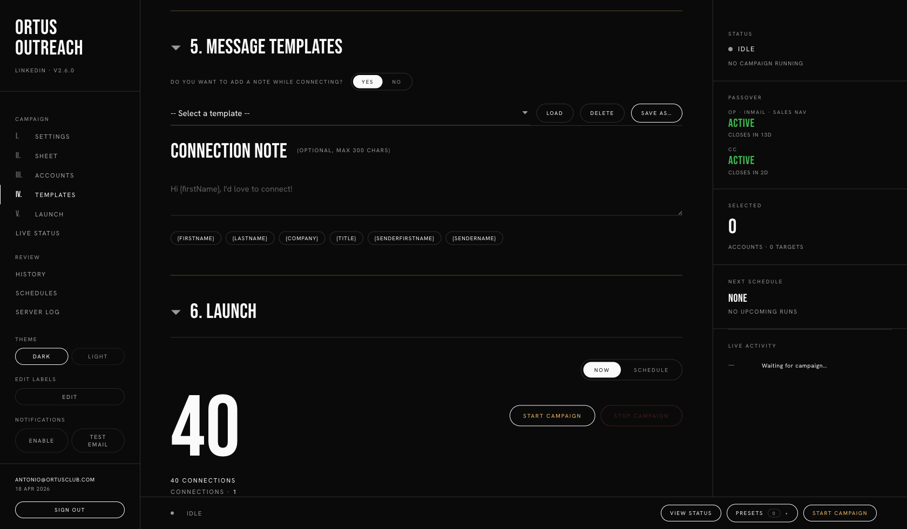

## 7.1 The add-a-note question

If you're in **Connect Only** mode, the first thing you see is:

> **Do you want to add a note while connecting?**   [Yes] [No]

- **No** (recommended for most campaigns) — sends a noteless invite. Slightly higher acceptance rates in most tests; no template writing required.
- **Yes** — reveals the **Connection Note** textarea (300 character max).

## 7.2 The template bar

Above every template editor is a bar:

- **Select a template** — dropdown of saved templates.
- **Load** — load the selected template into the editor.
- **Delete** — delete the selected saved template.
- **Save As…** — save whatever's currently in the editor under a new name.

Templates are stored per-user. They're not shared across GDs.

## 7.3 Template sections, by mode

| Mode | Visible template sub-sections |
|---|---|
| Connect Only (with note) | Connection Note |
| Connect Only (no note) | — |
| Check Status | — |
| Message Only | Follow-up Message |
| InMail Only | Subject + Body |
| Open Profile | Subject (optional) + Body |

## 7.4 Placeholder tags

Below each text area is a row of chips: `{firstName}`, `{lastName}`, `{company}`, `{title}`, etc. Click a chip to insert that placeholder at your cursor. At send time, the app swaps in the row's value from the sheet.

The chips are **dynamic** — if you preview a sheet with a column `City`, a `{city}` chip appears automatically.

If a placeholder has no value for a row (e.g. `{company}` but the company column is blank for that lead), the app leaves the placeholder text in place rather than sending a broken "Hi , I wanted…". Fill your sheet before you blame the template.

## 7.5 Writing tips (for Ortus campaigns)

- **Short notes beat long ones.** 150 characters is plenty for a connection note.
- **Lead with specificity.** Mention something only they would recognise — a mutual connection, a recent post, the event you're hosting.
- **Use `{firstName}` lightly.** One per note, up top. More than that reads as mail-merged.
- **Write in English unless the lead is clearly non-English.** Locale-specific templates are on the roadmap; for now, keep one template per language and run separate campaigns.

<div class="page-break"></div>

# 8. Launch — Now vs Schedule

The sixth section (§6 Launch) is where you press Go.

## 8.1 Launch hero

The hero at the top of the section restates the campaign in one line:

> **40** connections · **1** accounts · ETA **19:50**

If any of those numbers look wrong, go back up the page and fix them before launching. ETA is computed live from your rate × total ceiling.

## 8.2 Now mode

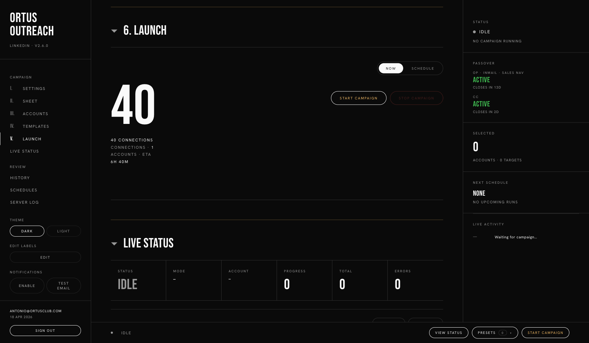

- Toggle is **Now** (default).
- Two buttons appear: **Start Campaign** (enabled) and **Stop Campaign** (disabled until a run is active).
- Press **Start Campaign** → campaign begins; page scrolls to **Live Status**.

To stop mid-run, press **Stop Campaign**. The app finishes the current lead, then quits cleanly. Expect a few seconds of delay — the browser windows it's running need to wrap up.

## 8.3 Schedule mode

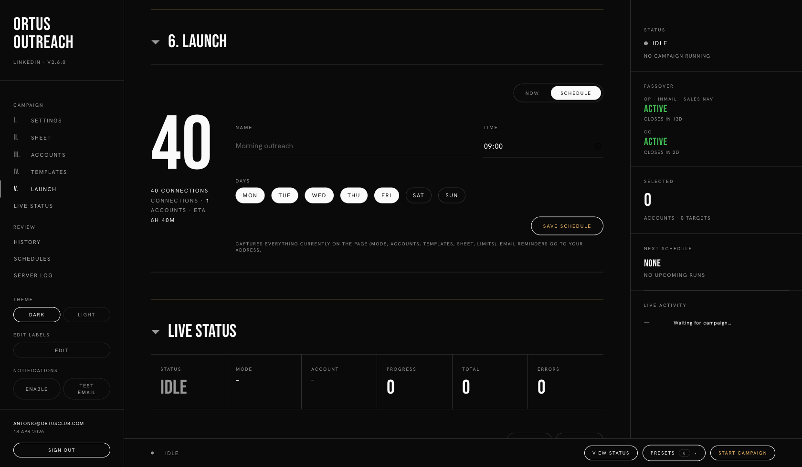

- Toggle is **Schedule**.
- Four fields appear: **Name**, **Time**, **Days** (Mon–Sun checkboxes), and **Save Schedule**.
- The schedule captures **everything on the page right now** — mode, rate, accounts, sheet URL, templates. If you change the mode later, existing schedules are unaffected; they remember the state at save time.

Defaults: 09:00, Monday–Friday.

Hit **Save Schedule**. The schedule now appears in the **Campaign Schedules** section lower down the page (see §11) and in the **Next schedule** card in the right pane.

Schedules fire server-side, so your laptop doesn't need to be open at the scheduled time — **but** the app server does need to be running. Confirm with the admin that server uptime covers your schedule window.

<div class="page-break"></div>

# 9. Live Status

While a campaign is running — and for a few seconds after it finishes — **Live Status** is where you watch it.

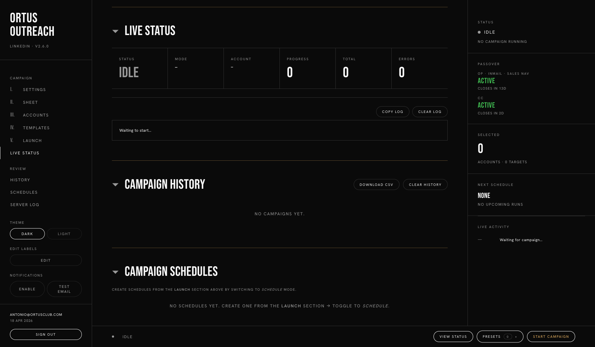

## 9.1 The six stat cards

- **Status** — Idle · Running · Stopping · Finished · Error.
- **Mode** — which mode is running.
- **Account** — the email of the GoLogin profile currently doing the work.
- **Progress** — actions sent so far **in this run**.
- **Total** — lifetime total for the day (across all runs).
- **Errors** — count of leads the app couldn't process.

## 9.2 The progress bar

Below the stat cards, a thin bar fills left-to-right as the campaign progresses. At 100% the campaign is done (or the ceiling was hit).

## 9.3 The log panel

Underneath, a scrolling log shows every step the app takes:

```
[10:32:14] ✓ marcus.r@ortusclub — connected to Gianna Rossi
[10:32:47] ✓ marcus.r@ortusclub — invited Paul Markham
[10:33:21] ⚠  marcus.r@ortusclub — profile unreachable (timeout)
[10:33:58] ✓ marcus.r@ortusclub — invited Sara Tovar
```

- `✓` green — action succeeded.
- `⚠ ` amber — soft error, lead was skipped; campaign continues.
- `✗` red — hard error; campaign may stop depending on the type.

**Copy Log** copies the full log to your clipboard. **Clear Log** wipes the panel (does not affect the server log or history).

## 9.4 What to do while it runs

Nothing. Seriously — don't touch the browser windows GoLogin opens, don't close the tab, don't close the laptop lid. Walk away, come back in the ETA window.

If you need to stop early, press **Stop Campaign** in §6 Launch or at the bottom run bar.

<div class="page-break"></div>

# 10. Presets

A preset is a **saved bundle of the whole page state** — mode, rate, accounts, sheet URL, templates, add-note toggle, everything. Good for campaigns you run repeatedly.

## 10.1 The presets popover

In the run bar at the bottom of every page, there's a **Presets** pill. Click it to open the popover upward.

The popover has three rows:

- **Last Used** (pinned) — the configuration of your most recent campaign. One click to reload it.
- **Saved** — presets you've explicitly named and saved.
- **+ Save current as…** — saves what's on screen right now under a name you type.

## 10.2 Typical Ortus presets

A team will usually save something like:

- **Weekly connect — assigned** — Connect Only, 6/hr, 40/day, your accounts, standard note template.
- **Monday warm-up** — Check Status across all assigned accounts.
- **VIP InMail** — InMail Only, 3/hr, 10/day, one account, specific subject line.

Saving is cheap; use liberally. Presets don't auto-run — they load the config and wait for you to press Start.

## 10.3 Deleting a preset

Open the popover, hover a preset, use the small × that appears on the right. Deletion is immediate; there's no undo.

<div class="page-break"></div>

# 11. Passover — watching the credit clock

LinkedIn's premium features reset on a cycle. We call this the **passover**. Three different clocks:

| Passover | Covers | Reset cadence |
|---|---|---|
| **OP · InMail · Sales Nav** | Open Profile + InMail credits + Sales Nav actions | Monthly |
| **CC** | Connection credits on premium tier | Weekly |

## 11.1 Where you see it

- **Top header stat** — **Passover Active** / **Passover Closed** / countdown.
- **Right pane** — both clocks with days remaining and reset date.
- **Accounts section banner** — visible when you're about to pick accounts.

## 11.2 How to play it

- **Active, many days left** — act normally.
- **Active, less than 3 days left** — conserve credits. Don't start large InMail campaigns; save them for day one of the new cycle.
- **Closed** — the feature is effectively offline until the reset. Connect Only still works; InMail and OP won't.

<div class="page-break"></div>

# 12. History

Every completed campaign is logged to **Campaign History**, which sits below Live Status.

Each row shows: start time, mode, account(s) used, sheet, total actions, errors, duration. Click a row to expand the per-lead log.

- **Download CSV** — exports the full history table for reporting.
- **Clear History** — wipes it. Don't clear on a whim; there's no undo.

History is **local to your user** — what you see is your own runs, not the whole team's. For team-wide reporting, pull the sheet(s) directly or ask the admin for a roll-up.

<div class="page-break"></div>

# 13. Schedules

**Campaign Schedules** (below History) lists everything saved from the Launch → Schedule panel.

Each row: name, time, days, mode, account count. Columns include:

- **Enable / Disable** toggle — pauses the schedule without deleting it.
- **Run now** — fires the scheduled campaign immediately without waiting for its next window.
- **Delete** — removes it permanently.

The next upcoming schedule is also shown in the right pane under **Next schedule** so you can see at a glance what's queued.

<div class="page-break"></div>

# 14. Troubleshooting

A short field guide to the problems you'll hit.

## 14.1 "Failed to fetch Google Sheet (HTTP 401)"

The sheet isn't public. Fix: open the sheet, **Share → Change → Anyone with the link → Viewer**.

## 14.2 "Auth expired" on a GoLogin profile

The account's LinkedIn session has timed out. Fix: in GoLogin desktop, open that profile, log into LinkedIn manually, close. Come back to Ortus Outreach, hit **Refresh** in the Accounts section, the profile should be back to Available.

## 14.3 Campaign stuck at "Running" with no progress

Two common causes:

- **The GoLogin window was closed.** The app relies on the windows it opened — if you closed them, actions stop. Press **Stop Campaign**, then start again.
- **LinkedIn is presenting a captcha.** Open the GoLogin window; if you see a captcha or "Verify it's you" screen, solve it manually. Actions resume on the next tick.

## 14.4 "Message button not found" in the log

The lead isn't 1st-degree, so the Message mode has nothing to click. Expected in Message mode when not all leads are connections; the row is skipped and the campaign continues.

## 14.5 "No Open Profile template" in OP mode

You're in Open Profile mode but the Body template is empty. Go back to §5 Templates and fill it in.

## 14.6 Invites aren't sending — LinkedIn weekly limit

You've hit the weekly invite cap on that account. Wait until the weekly reset (typically Monday 00:00 UTC), or rotate to another account.

## 14.7 Numbers in the header don't match what I just sent

Header stats poll every few seconds. Wait 10 seconds, they'll catch up. If they're still off after 30 seconds, reload the page — your session may have missed a broadcast.

## 14.8 "Stop Campaign" doesn't respond immediately

The app finishes the current in-flight action before stopping. Expect up to ~30 seconds of delay if it's in the middle of a profile visit. If it's still running after a minute, reload the page; state will reconcile.

## 14.9 Where to look when nothing else helps

Open the sidebar and click **Server Log**. The inline panel tails the backend's console output — errors, warnings, and every decision the app makes. Copy-paste that to the admin when you file a bug.

<div class="page-break"></div>

# 15. Glossary

**Account** — one LinkedIn login, represented in the app as a GoLogin profile.

**Assignee** — optional column in the sheet that marks a profile/lead as belonging to a specific GD.

**CC** — connection credits on LinkedIn premium. Weekly passover.

**GoLogin profile** — an isolated browser instance with its own cookies and fingerprint. One profile = one LinkedIn account.

**Hero summary** — the big numbers at the top of §2 Rate & Limits (Actions / Duration / Finishes).

**InMail** — LinkedIn's premium direct-message-anyone feature. Costs a credit per send.

**Lead** — one row in the source sheet.

**Mode** — the action the campaign takes. One of five (§3).

**Open Profile (OP)** — a LinkedIn Premium setting some members enable; lets anyone DM them for free.

**Passover** — LinkedIn's credit-reset cycle. Monthly for OP/InMail/Sales Nav; weekly for CC.

**Preset** — a saved snapshot of page state.

**Rate** — connections per account per hour.

**Run** — a single execution of a campaign.

**Schedule** — a saved campaign configured to run on a recurring day/time.

**Sheet** — the Google Sheet that holds leads.

**State of Operations (SoO)** — the admin sheet that gates who can sign up.

**Template** — a message (note, follow-up, InMail body, OP body) with `{placeholder}` tokens.

<div class="page-break"></div>

# 16. Quick reference — the one page

Keep this near the laptop.

## Flow

1. Sign in → pick Mode → set Rate (defaults OK) → paste Sheet URL → Preview → pick Accounts → set Templates → Launch (Now or Schedule).

## Sane defaults

- **Connect Only**, 6 per hour, 40 per account ceiling.
- Note: **No**, for first campaigns.
- One account at first, then scale up.

## Red flags mid-run

- **Closed the GoLogin window** → stops.
- **Closed the laptop lid** → stops.
- **Auth expired on a profile** → re-login manually in GoLogin desktop → Refresh.
- **Captcha screen in GoLogin window** → solve it manually → campaign continues.

## Rate-limit intuition

- 6/hr × 6hr × 1 acct = 36 actions / day (safe).
- 10/hr × 4hr × 3 acct = 120 actions / day (fast but edgy).
- Over 15/hr on a cold account = you will be flagged.

## Passover

- **OP / InMail / Sales Nav** — monthly.
- **CC** — weekly (Sunday → Sunday).
- Don't start big InMail campaigns in the last 72 hours of the monthly cycle.

## What gets written to the sheet

`Status`, `OP`, `Message`, `InMail`, `Account Used`, `Date Last Action`.

## If it breaks

1. Sidebar → **Server Log** — tail the backend.
2. Copy the log, note the time, share with admin.
3. Most problems are auth-expired profiles — always check that first.

---

<div style="text-align: center; margin-top: 40px; font-size: 0.72rem; letter-spacing: 0.2em; text-transform: uppercase; color: #999;">

Ortus Club · GDs Manual · {{VERSION}}

</div>
